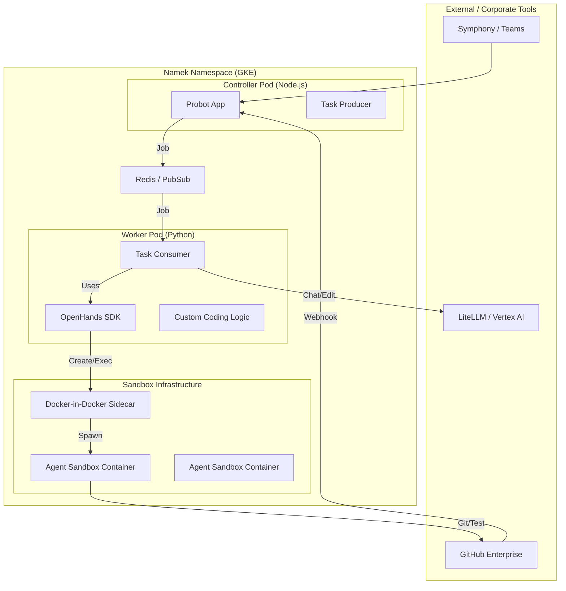

> 用户问了几个重要的问题：
> 
> 1. 是否有其他值得参考的 GitHub 开源项目
> 2. 由于无法连接 DeepAgents 用的 sandbox 提供商（Daytona、Modal、Runloop），需要基于 GKE 自研 sandbox
> 3. 是否 GCP/GKE 有类似的技术可以直接实现
> 4. 未来希望能展示 agents 在 sandbox 中的实现过程（browser-use、chrome-devs-mcp）
> 5. 需要一个长期投资的、最好是基于 GKE 的开源 sandbox 实现，支持用户通过浏览器交互
> 
> 我需要搜索：
> 1. 其他开源的 SWE agent / coding agent 项目
> 2. GKE / GCP 上的 sandbox 技术
> 3. browser-use 项目
> 4. 基于 Kubernetes 的 sandbox 开源实现
> 5. 支持浏览器交互的 sandbox 技术
> 6. chrome-devs-mcp 相关信息
> 
> 让我进行搜索。

很好的追問！讓我搜索一下 GKE 原生的 sandbox 技術以及其他你可能遺漏的開源項目。


讓我再搜索一些更具體的技術：


太棒了！我找到了非常關鍵的信息。讓我為你整理一份完整的分析報告。

---

## 完整分析：你可能遺漏的項目和 GKE 原生 Sandbox 解決方案

### 一、你可能遺漏的開源項目

#### 1. **OpenHands** (原 OpenDevin) - 強烈推薦
Formerly known as OpenDevin, OpenHands is arguably the most popular open-source AI agent today. They provide a convenient Docker command to try it out locally as well a headless mode for scripting.[[1]](https://modal.com/blog/open-ai-agents)

Across multiple LLM backends, our SDK achieves strong results on SWE-Bench Verified and GAIA benchmarks, demonstrating both state-of-the-art performance and the generality of the architecture to operate consistently across diverse model providers. The OpenHands Software Agent SDK is fully open-sourced under the MIT License.[[7]](https://arxiv.org/html/2511.03690v1)

**關鍵優勢：**
- Deploy in isolated Docker or Kubernetes environments, self-hosted or cloud, with full access control and auditability.[[8]](https://openhands.dev/)
- Compared with existing SDKs from OpenAI, Claude and Google, OpenHands uniquely integrates native sandboxed execution, lifecycle control, model-agnostic multi-LLM routing, and built-in security analysis.[[7]](https://arxiv.org/html/2511.03690v1)
- On SWE-Bench Verified that measures an agent's ability in software engineering tasks, SDK achieves 72% resolution rate using Claude Sonnet 4.5 with extended thinking; On the GAIA that measures an agent's generic computer task-solving capability, SDK achieves 67.9% accuracy with Claude Sonnet 4.5.[[7]](https://arxiv.org/html/2511.03690v1)

#### 2. **SWE-Agent** - 由 SWE-Bench 原作者創建
SWE-Agent is a multi-purpose agent framework created by the same authors as the SWE-bench benchmark itself.[[5]](https://medium.com/@te2be/coding-agents-open-source-approaches-on-swe-bench-074cc28c5bb0)

#### 3. **Aider** - 老牌且穩定
Aider is one of the oldest approaches to AI pair programming and remains very popular. It's quite easy to install via pip and regularly receives new features. This terminal-based tool has a Python API that's well-suited for automation. The author has conducted extensive research on editing formats for LLMs and has developed a challenging benchmark.[[5]](https://medium.com/@te2be/coding-agents-open-source-approaches-on-swe-bench-074cc28c5bb0)

#### 4. **Refact.ai Agent** - 開源且在 SWE-Bench Lite 上達到 SOTA
Refact.ai Agent has achieved the #1 score on SWE-bench Lite — solving 179 out of 300 tasks, for a 60.0% success rate.[[10]](https://refact.ai/blog/2025/sota-on-swe-bench-lite-open-source-refact-ai/)

Although Refact.ai Agent can also interface with real-world tools (GitHub, Docker, PostgreSQL, etc.) and 1000+ tools via MCP servers, these integrations weren't used in the benchmark run — but are part of standard workflows in user environments.[[10]](https://refact.ai/blog/2025/sota-on-swe-bench-lite-open-source-refact-ai/)

#### 5. **Augment Code Agent** - 開源且結合多模型
We have achieved a 65.4% success rate on SWE-bench verified. We provide a technical breakdown below and have open-sourced our approach to hitting the top published spot on the leaderboard.[[6]](https://www.augmentcode.com/blog/1-open-source-agent-on-swe-bench-verified-by-combining-claude-3-7-and-o1)

---

### 二、GKE Agent Sandbox - 這是你的完美解決方案！

這是 Google 在 2025 年 11 月剛剛發布的，完全符合你的需求：

At its core, Agent Sandbox is a new Kubernetes primitive built with the Kubernetes community that's designed specifically for agent code execution and computer use, delivering the performance and scale needed for the next generation of agentic AI workloads. Foundationally built on gVisor with additional support for Kata Containers for runtime isolation, Agent Sandbox provides a secure boundary to reduce the risk of vulnerabilities that could lead to data loss, exfiltration or damage to production systems. We're continuing our commitment to open source, building Agent Sandbox as a Cloud Native Computing Foundation (CNCF) project in the Kubernetes community.[[2]](https://cloud.google.com/blog/products/containers-kubernetes/agentic-ai-on-kubernetes-and-gke)

**關鍵特性：**

1. **開源且 CNCF 項目**
Google is launching Agent Sandbox, a new Kubernetes primitive built for AI agents. The technology provides kernel-level isolation and can run thousands of sandboxes in parallel. Google built Agent Sandbox as an open-source project within the Cloud Native Computing Foundation. The technology is based on gVisor, with additional support for Kata Containers.[[5]](https://www.techzine.eu/news/infrastructure/136294/google-introduces-agent-sandbox-for-kubernetes/)

2. **極速啟動 - 適合長期投資**
Agent Sandbox delivers sub-second latency for fully isolated agent workloads, up to a 90% improvement over cold starts.[[1]](https://cloud.google.com/blog/products/containers-kubernetes/gke-and-kubernetes-at-kubecon-2025)

3. **GKE Pod Snapshots 支持**
When combined with Agent Sandbox, Pod Snapshots lets teams provision sandbox environments from snapshots, so they can start up in seconds. GKE Pod Snapshots supports snapshot and restore of both CPU- and GPU-based workloads, bringing pod start times from minutes down to seconds. With Pod Snapshots, any idle sandbox can be snapshotted and suspended, saving significant compute cycles with little to no disruption for end-users.[[2]](https://cloud.google.com/blog/products/containers-kubernetes/agentic-ai-on-kubernetes-and-gke)

4. **Python SDK - 開發者友好**
Teams building today's agentic AI or reinforcement learning (RL) systems should not have to be infrastructure experts. We built Agent Sandbox with AI engineers in mind, designing an API and Python SDK that lets them manage the lifecycle of their sandboxes, without worrying about the underlying infrastructure.[[2]](https://cloud.google.com/blog/products/containers-kubernetes/agentic-ai-on-kubernetes-and-gke)

For AI developers, the build provides a Python SDK that enables them to manage the lifecycle of sandboxes without requiring infrastructure knowledge.[[5]](https://www.techzine.eu/news/infrastructure/136294/google-introduces-agent-sandbox-for-kubernetes/)

5. **Pre-warmed Pools**
Furthermore, administrators can configure pre warmed pools of sandboxes. This means a set of sandboxes are initialized and kept in a ready state, waiting for agent tasks. When a task arrives, a sandbox is immediately assigned from the warm pool, bypassing the traditional cold start penalty. This architecture enables sub second startup latency for fully isolated workloads, an improvement of up to ninety percent over conventional cold starts.[[7]](https://medium.com/@tahirbalarabe2/kubernetes-agent-sandbox-ai-security-d24978512179)

---

### 三、瀏覽器交互可視化解決方案

對於展示 agents 在 sandbox 中的實現過程，這裡有幾個 GKE 兼容的開源方案：

#### 1. **abcdesktop.io** - Kubernetes 原生桌面服務（推薦）
abcdesktop.io is a cloud native desktop service built on and for Kubernetes. abcdesktop.io is also a complete work environment accessible from a simple HTML 5 web browser, without any installation. Like serverless does, desktopless computing allocates desktop resources on demand.[[2]](https://www.abcdesktop.io/)

abcdesktop.io provides a way to run graphics software securely isolated in a container, and use a web browser HTML5 as display device. Because containers are lightweight and run without the extra load of an operating system, you can run many graphical applications on a single kernel or even on a kubernetes cluster.[[2]](https://www.abcdesktop.io/)

#### 2. **kVDI** - Kubernetes 原生 VDI
A Virtual Desktop Infrastructure running on Kubernetes. With soon to come webmesh integration.[[5]](https://github.com/webmeshproj/webmesh-vdi)

Containerized user desktops running on Kubernetes with no virtualization required (libvirt options may come in the future). All traffic between the end user and the "desktop" is encrypted.[[5]](https://github.com/webmeshproj/webmesh-vdi)

All traffic between processes is encrypted with mTLS. The UI for the "desktop" containers is placed behind a VNC server listening on a UNIX socket and a sidecar to the container will proxy validated websocket connections to it.[[5]](https://github.com/webmeshproj/webmesh-vdi)

#### 3. **code-server** - VS Code in Browser on Kubernetes
code-server is Microsoft Visual Studio Code running on a remote server and accessible directly from your browser. Visual Studio Code is a modern code editor with integrated Git support, a code debugger, smart autocompletion, and customizable and extensible features. This means that you can use various devices, running different operating systems, and always have a consistent development environment on hand.[[8]](https://www.digitalocean.com/community/tutorials/how-to-set-up-the-code-server-cloud-ide-platform-on-digitalocean-kubernetes)

#### 4. **Theia** - 開源 IDE 平台
An Open, Flexible and Extensible Cloud & Desktop IDE Platform. Theia is an extensible platform to develop full-fledged multi-language Cloud & Desktop IDE-like products with state-of-the-art web technologies. It allows you to have a full blown IDE just in your browser, and you can even load and use VSCode extensions.[[1]](https://itnext.io/kubernetes-and-ide-just-in-your-browser-killercoda-21ba309dd75c)

At Killercoda what really pushed us towards using Theia was the low footprint. Theia uses/needs maybe 100MB, whereas VSCode may need 1GB+.[[1]](https://itnext.io/kubernetes-and-ide-just-in-your-browser-killercoda-21ba309dd75c)

---

### 四、Browser-Use 整合方案

Browser Use connects AI agents directly to web browsers, enabling them to autonomously navigate, interact with, and extract information from websites.[[10]](https://www.infoworld.com/article/3812644/browser-use-an-open-source-ai-agent-to-automate-web-based-tasks.html)

Browser Use is an open-source library designed to empower AI agents with seamless web browsing capabilities for Python developers. It provides a robust framework that enables AI to interact with websites dynamically, mimicking human-like browsing behavior across different programming ecosystems. At the heart of Browser Use's browser automation is Playwright, a powerful cross-browser automation library developed by Microsoft. Playwright enables reliable, fast web automation by providing a unified API for Chromium, Firefox, and WebKit browsers. It offers advanced features like automatic waiting, network interception, and robust selector engines, which Browser Use leverages to create more intelligent and resilient web interaction agents.[[10]](https://www.infoworld.com/article/3812644/browser-use-an-open-source-ai-agent-to-automate-web-based-tasks.html)

---

### 五、推薦架構：整合所有組件

```
┌─────────────────────────────────────────────────────────────────────────┐
│                     Namek 完整架構 (GKE Native)                          │
├─────────────────────────────────────────────────────────────────────────┤
│                                                                          │
│  ┌─────────────────────────────────────────────────────────────────────┐│
│  │                    入口層 (你已有的)                                  ││
│  │  Symphony/Teams → Probot (Node.js) → GitHub Webhooks                 ││
│  └─────────────────────────────────────────────────────────────────────┘│
│                              ↓                                           │
│  ┌─────────────────────────────────────────────────────────────────────┐│
│  │                    Agent 編排層                                       ││
│  │  選擇 1: OpenHands SDK (推薦)                                         ││
│  │    - 72% SWE-Bench Verified                                           ││
│  │    - 原生 Kubernetes sandbox 支持                                      ││
│  │    - Model-agnostic (LiteLLM 友好)                                    ││
│  │  選擇 2: DeepAgents + LangGraph                                       ││
│  │    - Planning + Subagents                                             ││
│  │    - 需要自己整合 sandbox                                              ││
│  └─────────────────────────────────────────────────────────────────────┘│
│                              ↓                                           │
│  ┌─────────────────────────────────────────────────────────────────────┐│
│  │               GKE Agent Sandbox (CNCF 開源)                           ││
│  │  • gVisor kernel-level isolation                                      ││
│  │  • Pre-warmed sandbox pools                                           ││
│  │  • Pod Snapshots (秒級啟動)                                            ││
│  │  • Python SDK 管理生命週期                                             ││
│  └─────────────────────────────────────────────────────────────────────┘│
│                              ↓                                           │
│  ┌─────────────────────────────────────────────────────────────────────┐│
│  │               可視化展示層 (Browser 交互)                              ││
│  │  選擇 1: abcdesktop.io (推薦 - K8s native)                            ││
│  │  選擇 2: kVDI + noVNC                                                 ││
│  │  選擇 3: code-server (VS Code in browser)                             ││
│  │  + Browser-Use (AI 操控瀏覽器)                                         ││
│  └─────────────────────────────────────────────────────────────────────┘│
│                              ↓                                           │
│  ┌─────────────────────────────────────────────────────────────────────┐│
│  │                    輸出層                                             ││
│  │  • GitHub PR/Issues (GitHub MCP)                                      ││
│  │  • GitHub Projects (任務管理)                                          ││
│  │  • restabuild (version bumping)                                       ││
│  │  • GKE 自動部署                                                        ││
│  └─────────────────────────────────────────────────────────────────────┘│
│                                                                          │
└─────────────────────────────────────────────────────────────────────────┘
```

---

### 六、我的最終推薦

| 組件 | 推薦方案 | 理由 |
|------|----------|------|
| **Agent 框架** | **OpenHands SDK** | 72% SWE-Bench，原生 K8s sandbox，MIT 開源，model-agnostic |
| **Sandbox** | **GKE Agent Sandbox** | Google 官方，CNCF 開源，gVisor，pre-warmed pools，你們是 GKE 用戶 |
| **瀏覽器可視化** | **abcdesktop.io + Browser-Use** | K8s native，HTML5 瀏覽器訪問，開源 |
| **IDE 展示** | **code-server 或 Theia** | VS Code 兼容，低內存佔用 |
| **備選 Agent** | **Refact.ai / DeepAgents** | 各有特色 |

**為什麼 OpenHands 優於 DeepAgents 對你的場景：**
1. 原生 sandbox 執行 - 你不需要額外整合
2. 更高的 benchmark 分數
3. 更成熟的生產部署經驗
4. VNC 和瀏覽器交互支持已內置

**GKE Agent Sandbox 是長期投資的最佳選擇，因為：**
1. Google 官方支持
2. CNCF 開源項目
3. 與你現有的 GKE 基礎設施完美整合
4. Python SDK 讓開發者不需要深入了解 K8s

---
Learn more:
1. [GKE Sandbox | GKE security | Google Cloud](https://cloud.google.com/kubernetes-engine/docs/concepts/sandbox-pods)
2. [Browser Use - Enable AI to automate the web](https://browser-use.com/)
3. [Introducing SWE-bench Verified | OpenAI](https://openai.com/index/introducing-swe-bench-verified/)
4. [Kubernetes and IDE just in your Browser | Killercoda | ITNEXT](https://itnext.io/kubernetes-and-ide-just-in-your-browser-killercoda-21ba309dd75c)
5. [GKE and Kubernetes at KubeCon 2025 | Google Cloud Blog](https://cloud.google.com/blog/products/containers-kubernetes/gke-and-kubernetes-at-kubecon-2025)
6. [Open-source AI agents | Modal Blog](https://modal.com/blog/open-ai-agents)
7. [How to setup a virtual desktop on Kubernetes in 15 minutes | by yannick misteli | DevOps Dudes | Medium](https://medium.com/devops-dudes/how-to-setup-a-virtual-desktop-on-kubernetes-in-15-minutes-b2d7f213e3e3)
8. [Use Sandbox with gVisor for GKE Clusters Nodes | Trend Micro](https://www.trendmicro.com/cloudoneconformity/knowledge-base/gcp/GKE/enable-gke-sandbox-with-gvisor.html)
9. [Agentic AI on Kubernetes and GKE | Google Cloud Blog](https://cloud.google.com/blog/products/containers-kubernetes/agentic-ai-on-kubernetes-and-gke)
10. [GitHub - browser-use/browser-use: 🌐 Make websites accessible for AI agents. Automate tasks online with ease.](https://github.com/browser-use/browser-use)
11. [GitHub - SWE-bench/SWE-bench: SWE-bench: Can Language Models Resolve Real-world Github Issues?](https://github.com/SWE-bench/SWE-bench)
12. [Kubernetes-based IDE running in your browser Red Hat CodeReady Workspaces](https://people.redhat.com/mskinner/rhug/q4.2020/CodeReady-Workspaces.pdf)
13. [All Hands AI Open Sources OpenHands CodeAct 2.1: A New Software Development Agent to Solve Over 50% of Real Github Issues in SWE-Bench - MarkTechPost](https://www.marktechpost.com/2024/11/01/all-hands-ai-open-sources-openhands-codeact-2-1-a-new-software-development-agent-to-solve-over-50-of-real-github-issues-in-swe-bench/)
14. [abcdesktop.io cloud native desktop - www.abcdesktop.io](https://www.abcdesktop.io/)
15. [Agentic AI Browser for Deep Search & Automation | Fellou](https://fellou.ai/)
16. [Amazon introduces SWE-PolyBench, a multilingual benchmark for AI Coding Agents | AWS DevOps & Developer Productivity Blog](https://aws.amazon.com/blogs/devops/amazon-introduces-swe-polybench-a-multi-lingual-benchmark-for-ai-coding-agents/)
17. [GitHub - astefanutti/kubebox: ⎈❏ Terminal and Web console for Kubernetes](https://github.com/astefanutti/kubebox)
18. [Google launches Agent Sandbox for secure AI agents on Kubernetes - TechInformed](https://techinformed.com/google-launches-agent-sandbox-for-secure-ai-agents-on-kubernetes/)
19. [5 AI Agents You Need to Know About - DEV Community](https://dev.to/ebonyl/5-ai-agents-you-need-to-know-about-3969)
20. [Running noVNC on Kubernetes to Access a Machine on my LAN](https://jhankins.dev/blog/2020/running-novnc-on-kubernetes-to-access-a-machine-on-my-lan/)
21. [Harden workload isolation with GKE Sandbox | GKE security | Google Cloud](https://cloud.google.com/kubernetes-engine/docs/how-to/sandbox-pods)
22. [Airtop Agents: Build Web Automations with Just Words](https://www.airtop.ai/)
23. [SWE-Bench Pro (Public Dataset)](https://scale.com/leaderboard/swe_bench_pro_public)
24. [Top Free, Open Source Kubernetes Dashboard in 2025](https://www.bytebase.com/blog/top-open-source-kubernetes-dashboard/)
25. [Google Debuts GKE Agent Sandbox, Inference Gateway at KubeCon - The New Stack](https://thenewstack.io/google-debuts-gke-agent-sandbox-inference-gateway-at-kubecon/)
26. [AI Coding Agents: What Works and What Doesn't](https://bssw.io/items/ai-coding-agents-what-works-and-what-doesn-t)
27. [Virtual Desktop Apps – FASRC DOCS](https://docs.rc.fas.harvard.edu/kb/vdi-apps/)
28. [GKE Sandbox : A gVisor based feature to increase security and isolation in containers](https://hub.packtpub.com/gke-sandbox-a-gvisor-based-feature-to-increase-security-and-isolation-in-containers/)
29. [Browserbase: A web browser for AI agents & applications](https://www.browserbase.com/)
30. [SWE-bench Leaderboards](http://www.swebench.com/)
31. [Coding Agents - Open Source Approaches on SWE-Bench](https://medium.com/@te2be/coding-agents-open-source-approaches-on-swe-bench-074cc28c5bb0)
32. [DevSpace - The Fastest Developer Tool for Kubernetes (open-source)](https://www.devspace.sh/)
33. [Google introduces Agent Sandbox for Kubernetes - Techzine Global](https://www.techzine.eu/news/infrastructure/136294/google-introduces-agent-sandbox-for-kubernetes/)
34. [GitHub - webmeshproj/webmesh-vdi: A Kubernetes-native Virtual Desktop Infrastructure](https://github.com/webmeshproj/webmesh-vdi)
35. [Securing Kubernetes with GVisor and GKE Sandbox | Better Programming](https://medium.com/better-programming/securing-kubernetes-with-gvisor-and-gke-sandbox-78c6b152b3a0)
36. [How to use Browser Automation in Foundry Agent Service - Microsoft Foundry | Microsoft Learn](https://learn.microsoft.com/en-us/azure/ai-foundry/agents/how-to/tools/browser-automation?view=foundry-classic)
37. [#1 open-source agent on SWE-Bench Verified by combining Claude 3.7 and O1 - Augment Code](https://www.augmentcode.com/blog/1-open-source-agent-on-swe-bench-verified-by-combining-claude-3-7-and-o1)
38. [What’s the Best IDE for Kubernetes Users?](https://thechief.io/c/editorial/whats-the-best-ide-for-kubernetes-users/)
39. [Google Cloud gifts AI agents for Kubernetes anniversary - SDxCentral](https://www.sdxcentral.com/news/google-cloud-gifts-ai-agents-for-kubernetes-anniversary/)
40. [Software Agent SDK - OpenHands Docs](https://docs.openhands.dev/sdk)
41. [Remote console access to virtual machines - Mirantis OpenStack for Kubernetes](https://docs.mirantis.com/mosk/latest/ref-arch/cloud-services/compute/remote-console-access.html)
42. [Kubernetes Engine features and guidance to help lock down your containers | Google Cloud Blog](https://cloud.google.com/blog/products/containers-kubernetes/kubernetes-engine-features-and-guidance-to-help-lock-down-your-containers)
43. [Introducing Operator | OpenAI](https://openai.com/index/introducing-operator/)
44. [Webkubectl - Running Kubectl Commands from your Web Browser - Civo.com](https://www.civo.com/learn/webkubectl-running-kubectl-commands-from-your-web-browser)
45. [Kubernetes Agent Sandbox AI Security | by Tahir | Nov, 2025 | Medium](https://medium.com/@tahirbalarabe2/kubernetes-agent-sandbox-ai-security-d24978512179)
46. [The OpenHands Software Agent SDK: A Composable and Extensible Foundation for Production Agents](https://arxiv.org/html/2511.03690v1)
47. [GitHub - jmcdice/k8s-ubuntu-desktop: Web Based (novnc) Ubuntu Linux Desktop (Mate) for Kubernetes](https://github.com/jmcdice/k8s-ubuntu-desktop)
48. [How gVisor protects Google Cloud services from CVE-2020-14386 | Google Cloud Blog](https://cloud.google.com/blog/products/containers-kubernetes/how-gvisor-protects-google-cloud-services-from-cve-2020-14386)
49. [New AI Browser Agent Can Automate Almost Anything | Medium](https://christopherkokoski.medium.com/new-ai-browser-agent-can-automate-almost-anything-2f44cd91f289)
50. [8 benchmarks shaping the next generation of AI agents | AI Native Dev](https://ainativedev.io/news/8-benchmarks-shaping-the-next-generation-of-ai-agents)
51. [How To Set Up the code-server Cloud IDE Platform on DigitalOcean Kubernetes | DigitalOcean](https://www.digitalocean.com/community/tutorials/how-to-set-up-the-code-server-cloud-ide-platform-on-digitalocean-kubernetes)
52. [How Agent Sandbox and GKE Pod Snapshots Are Shaping Secure Agentic AI on Kubernetes | Joshua Berkowitz](https://joshuaberkowitz.us/blog/news-1/how-agent-sandbox-and-gke-pod-snapshots-are-shaping-secure-agentic-ai-on-kubernetes-1812)
53. [OpenHands | The Open Platform for Cloud Coding Agents](https://openhands.dev/)
54. [GitHub - netgroup-polito/KubernetesOnDesktop: University Project with the aim of running user applications on a remote cluster](https://github.com/netgroup-polito/KubernetesOnDesktop)
55. [Docker in a GKE sandbox - gVisor](https://gvisor.dev/docs/tutorials/docker-in-gke-sandbox/)
56. [HARPA AI Browser Agent | ChatGPT, Claude, Gemini, Perplexity](https://harpa.ai/)
57. [SWE-bench Verified | Epoch AI](https://epoch.ai/benchmarks/swe-bench-verified)
58. [How to access the Developer Sandbox for Red Hat OpenShift | Red Hat Developer](https://developers.redhat.com/articles/2023/03/30/how-access-developer-sandbox-red-hat-openshift)
59. [GKE Sandbox | GKE security | Google Cloud Documentation](https://docs.cloud.google.com/kubernetes-engine/docs/concepts/sandbox-pods)
60. [OpenHands CodeAct 2.1: An Open, State-of-the-Art Software Development Agent](https://www.all-hands.dev/blog/openhands-codeact-21-an-open-state-of-the-art-software-development-agent)
61. [Viewers - IsardVDI Documentation](https://isard.gitlab.io/isardvdi-docs/user/viewers/viewers/)
62. [gVisor improves performance with root filesystem overlay | Google Open Source Blog](https://opensource.googleblog.com/2023/04/gvisor-improves-performance-with-root-filesystem-overlay.html)
63. [Browser Use: An open-source AI agent to automate web-based tasks | InfoWorld](https://www.infoworld.com/article/3812644/browser-use-an-open-source-ai-agent-to-automate-web-based-tasks.html)
64. [Open-Source Refact.ai Agent is SOTA on SWE-bench Lite With a 60.0% Score - Refact.ai](https://refact.ai/blog/2025/sota-on-swe-bench-lite-open-source-refact-ai/)
65. [Useful Interactive Terminal and Graphical UI Tools for Kubernetes](https://williamlam.com/2020/04/useful-interactive-terminal-and-graphical-ui-tools-for-kubernetes.html)
66. [Google Accelerates AI On Kubernetes With Agent Sandbox And GKE Pod Snapshots - Open Source For You](https://www.opensourceforu.com/2025/11/google-accelerates-ai-on-kubernetes-with-agent-sandbox-and-gke-pod-snapshots/)
67. [Introducing OpenHands LM 32B -- A Strong, Open Coding Agent Model](https://openhands.dev/blog/introducing-openhands-lm-32b----a-strong-open-coding-agent-model)
68. [VNC Desktop - IMAP](https://darkroom.ast.cam.ac.uk/help/docs/advanced/vnc/)


---
這是一個非常切中痛點的問題。在企業內部環境（尤其是金融/銀行業）構建 Agentic Workflow 時，「**與公網隔離的 Sandbox**」和「**可視化調試**」是最難處理的兩個環節。

針對你的需求，我整理了以下開源項目參考和基於 GKE 的自研方案建議：

---

### 一、 你可能 Miss Out 的關鍵開源項目

除了 `deepagents` 和 `LangGraph`，有兩個項目在「**Sandbox 抽象**」和「**可視化交互**」方面做得非常出色，極具參考價值：

#### 1. **OpenHands (原 OpenDevin)**
這是目前開源界最接近 Devin 的實現，也是你構建 `Namek` 最好的參考對象。
* **為什麼值得參考：**
    * **成熟的 Sandbox Runtime 架構：** 它設計了一套 Runtime 接口，支持 Docker（本地）和 **Daytona**（遠程）。它的架構展示了如何將 Agent 的指令（Bash, Edit, Browser）轉發給隔離環境。
    * **優秀的 UI/UX：** 它有一個基於瀏覽器的前端，可以實時展示 Agent 打開的瀏覽器畫面（通過 noVNC）、Terminal 的操作過程和文件編輯。這正是你想要的「展示實現過程」。
    * **Event Stream 機制：** 它的前後端通信基於 WebSocket Event Stream，這對於實時 Debug Agent 行為非常有借鑑意義。

#### 2. **SWE-agent (普林斯頓大學)**
* **為什麼值得參考：**
    * **Agent-Computer Interface (ACI)：** 它定義了一套 Agent 專用的 Shell 交互標準（不僅僅是普通的 Bash，而是優化過輸出格式的 Shell）。這對於提高 LLM 在 Sandbox 內的執行成功率至關重要。
    * **自定義環境容器化：** 它展示了如何打包標準化的開發環境鏡像，這對你基於 GKE 構建鏡像有直接幫助。

---

### 二、 GKE 環境下的 Sandbox 解決方案（自研/自託管）

針對你提到的「無法連接外部 Sandbox API」且「只能基於 GKE 自研」的情況，這裡有三層技術方案，從底層安全到上層管理：

#### 1. 底層安全：GKE Native 技術 (**gVisor**)
你問到 Google 是否有類似技術——答案是 **GKE Sandbox**。
* **它是什麼：** 這是 GKE 的原生功能，基於 **gVisor**。它在 Pod 和宿主機 Kernel 之間加了一個用戶態內核（Sentry），提供了極強的隔離性。
* **如何使用：** 你只需在 GKE Node Pool 上開啟 `GKE Sandbox`，然後在 Pod spec 中指定 `runtimeClassName: gvisor`。
* **局限性：** 它只解決「安全隔離」問題（防止 Agent 逃逸），不解決「環境管理」問題（快速啟動、狀態重置、API 調用）。**你不能單靠它，它是地基。**

#### 2. 管理層推薦：**Daytona (Open Source / Self-Hosted)**
這是我建議你長期投資的方案。
* **為什麼選它：**
    * **完全支持 Air-Gapped (離線) 部署：** Daytona 的開源版明確支持在私有 Kubernetes 集群上自託管，不需要連接公網 License Server。
    * **標準化環境 (Dev Container)：** 它原生支持 `.devcontainer` 標準。這意味著你可以為你的 Agent 定義一個 `devcontainer.json`，Daytona 會在 GKE 上自動拉起對應的 Pod。
    * **API 驅動：** 它提供了 API 來創建、連接和銷毀環境，完美替代 `deepagents` 依賴的 Runloop/Daytona Cloud。

#### 3. 替代方案：**E2B (Self-Hosted)**
* E2B 專門為 AI Code Execution 設計，比 Daytona 更輕量（基於 Firecracker microVM），啟動速度極快（毫秒級）。
* **注意：** 雖然 E2B 核心（`e2b-dev/infra`）是開源的並且支持 Terraform 部署到 GCP，但在企業內部維護一套 Firecracker 集群比維護標準的 K8s Pod (Daytona 模式) 運維成本要高得多。**除非你們團隊有很強的底層虛擬化運維能力，否則首選 Daytona + GKE。**

---

### 三、 未來展望：可視化與自動 Debug 實現路徑

你提到的 `browser-use` 和 `chrome-devs-mcp` 是非常好的切入點，我建議的架構如下：

#### 推薦架構：**Headless Sidecar 模式**

在你的 GKE Sandbox Pod 中，不只運行代碼環境，而是部署一個「組合拳」容器：

1.  **Main Container (Agent 環境):** 運行 Python/Node.js 環境，供 Agent 執行代碼。
2.  **Sidecar (Browser):** 運行 Headless Chrome。
    * 開啟 `--remote-debugging-port=9222` (CDP 協議)。
3.  **Visualization (可選):** 運行一個輕量級的 noVNC 服務，將 Chrome 的畫面串流出來。

**具體整合方式：**

* **Browser-Use 集成：** `browser-use` 庫支持連接遠端 Chrome (`connect_to_browser`)。你可以讓你的 Agent (在 Main Container) 通過 `localhost:9222` 控制 Sidecar 中的 Chrome。
* **Chrome-Devs-MCP 集成：** 這是未來的亮點。你可以在 Main Container 中運行 `chrome-devs-mcp` Server，讓它連接 Sidecar 的 Chrome。
    * **效果：** 當 Agent 運行網頁測試出錯時，Agent 不僅能看到網頁截圖，還能通過 MCP 讀取 Chrome Console Logs、Network 請求失敗原因，甚至直接讓 Agent 進行 "Inspect Element" 獲取 DOM 結構，實現**真正的自動化前端 Debug**。

### 總結建議 (Action Plan)

1.  **基礎設施 (Ops):** 在 GKE 上啟用 **GKE Sandbox (gVisor)** 以確保運行不可信代碼的安全性。
2.  **中間件 (Platform):** 部署 **Daytona Open Source** 到 GKE 集群，作為內部 Sandbox 管理平台。
3.  **參考實現 (Dev):** 研究 **OpenHands** 的架構，特別是它如何通過 WebSocket 將 Sandbox 內的 Terminal 和 Browser 畫面傳回前端。
4.  **Agent 實現 (AI):** 使用 `browser-use` + `chrome-devs-mcp` 連接 GKE Pod 內的 Headless Chrome，實現具備視覺和 Debug 能力的高級 Agent。

這個架構既滿足了銀行的合規隔離要求（GKE+gVisor+私有部署），又保留了最強的擴展性（MCP+Browser Use）。

---

Choice A
這是一個非常深入的架構選擇問題。基於你對「GKE 自研 / 私有化部署」、「Sandbox 可視化」以及「核心 Agent 管理」的明確需求，我對 OpenHands 和 LangChain DeepAgents 進行了代碼級的深度對比分析。

結論先行：推薦 OpenHands 作為核心基座
雖然 DeepAgents (基於 LangGraph) 提供了很好的編排靈活性，但對於你要構建的平台級應用 Namek 而言，OpenHands 是更成熟、更接近「操作系統級」的選擇。

以下是深度的代碼與架構解析：

一、 架構深度對比：OpenHands vs. DeepAgents
這兩個項目的「世界觀」完全不同：

1. OpenHands (原 OpenDevin)
定位： 全棧 AI 軟體工程師 (Platform-in-a-Box)。

核心架構 (Event Sourced Runtime)：

State Management: 它不使用 LangGraph 那樣的「狀態機」，而是使用 Event Stream (事件流)。所有的用戶指令、工具輸出、文件變更都被視為 Event。這使得它的「可回溯性」和「即時交互」非常強。

Runtime Architecture: 這是它最強大的地方。它設計了一個 Runtime 抽象層，默認實現是 DockerRuntime。

Sidecar 模式: 在它的 Docker Runtime 內部，它不僅僅是啟動一個容器，還會在容器內注入一個 Action Server。Agent 的指令（Bash, Edit, Browser）是通過 HTTP/WebSocket 發送給這個容器內的 Server 執行的。這意味著它天生就支持遠程執行和狀態保持。

Frontend-Backend Sync: 它的前後端通信完全基於 WebSocket 事件流，這完美符合你「實時展示實現過程」的需求。

2. LangChain DeepAgents
定位： 高度可定製的 Agent 編排框架 (Framework)。

核心架構 (Graph State Machine)：

State Management: 基於 LangGraph 的 StateGraph。所有的上下文（Context）都保存在 Graph State 中。這適合定義複雜的「工作流（Workflow）」，例如：先計劃 -> 再執行 -> 失敗則重試。

Sandbox: DeepAgents 的 Sandbox 更多是一個「工具接口 (Tool)」。代碼中它定義了一個 SandboxBackendProtocol。雖然它支持 Daytona 和 Runloop，但本質上它是把 Sandbox 當作一個「外部 API」來調用，而不是像 OpenHands 那樣去「管理」整個運行時的生命週期。

二、 對於「GKE 自研 Sandbox」的適配性
這點對你至關重要，OpenHands 在這裡有壓倒性優勢。

OpenHands 的優勢：

Kubernetes Native 支持： OpenHands 社區非常活躍，最近剛合併了對 Kubernetes Runtime 的支持 (PR #8814)。這意味著你可以直接配置它在 GKE 上為每個 Task 啟動一個 Pod，而不是在 Docker 裡跑 Docker。

自定義鏡像： 你可以輕鬆構建一個包含你們公司內部證書、工具鏈、甚至 browser-use 依賴的 Docker 鏡像，然後在 config.toml 中指定 sandbox.base_container_image。OpenHands 會自動在這個鏡像裡注入它的 Agent Server 並啟動。

DeepAgents 的挑戰：

如果你要在 GKE 上自研，你需要自己實現 SandboxBackendProtocol。你需要寫代碼去調用 K8s API 創建 Pod，執行 kubectl exec 來運行命令，並處理文件傳輸。這等於你要自己重寫一個簡易版的 Daytona。

三、 關於 browser-use 與可視化的集成
你提到了 browser-use 和 chrome-devs-mcp，這是實現可視化交互的關鍵。

OpenHands 的集成方式 (推薦)：

OpenHands V1 架構已經全面支持 MCP (Model Context Protocol)。

你可以將 browser-use 封裝成一個 MCP Server (或者直接使用它自帶的 MCP 能力)，然後在 OpenHands 的配置中啟用這個 MCP Server。

可視化優勢： OpenHands 的前端原生支持 Observation 的渲染。你可以修改前端組件，讓 browser-use 返回的截圖直接顯示在對話流中，甚至像它現在展示「瀏覽器操作」一樣實時串流畫面。

DeepAgents 的集成方式：

你需要將 browser-use 封裝成 LangChain Tool。

雖然技術上可行，但你需要自己處理「如何將瀏覽器畫面傳回給用戶」這個問題。DeepAgents 默認只處理文本和結構化數據，圖像傳輸和實時串流需要你自己開發前端和後端通道。

四、 綜合推薦與實現路徑
對於你的 Namek 項目，我建議採用 OpenHands 為核心 + 自定義插件 的模式，而不是從頭用 LangChain 拼裝。

推薦架構圖
Code snippet
graph TD
    User[用戶 (Browser)] -->|WebSocket| NamekWeb[Namek 前端 (OpenHands UI Fork)]
    NamekWeb -->|Event Stream| OpenHandsServer[OpenHands Server (GKE Deployment)]
    
    subgraph GKE_Cluster
        OpenHandsServer -->|K8s API| SandboxPod[Sandbox Pod (Task Environment)]
        
        subgraph SandboxPod
            ActionServer[Action Execution Server (注入進去的)]
            AgentEnv[Python/Node 環境]
            HeadlessChrome[Chrome for Browser-Use]
        end
    end

    OpenHandsServer -->|LiteLLM| InternalLLM[內部 LLM]
具體實施步驟：
Fork OpenHands： 不要直接用，Fork 一份代碼，因為你需要深度定製。

配置 K8s Runtime： 利用 OpenHands 最新的 Kubernetes Runtime 功能，配置它連接你的 GKE 集群。

構建自定義 Sandbox 鏡像：

基於 Ubuntu/Debian。

安裝 browser-use 及其依賴 (Playwright, Chrome)。

安裝 chrome-devs-mcp。

集成 MCP： 在 OpenHands 的 config.toml 中配置 chrome-devs-mcp，讓 Agent 能通過 MCP 協議控制 Sandbox 裡的 Chrome。

總結
DeepAgents 適合：你需要構建一個非常特殊的、非編程類的 Agent 工作流（比如純文本分析、審批流），且不需要複雜的環境隔離。

OpenHands 適合：你要構建一個編程助手或自動化操作平台，需要隔離環境、需要看到操作過程、需要複雜的工具交互。

OpenHands 是你目前最佳的起點，它已經解決了 80% 關於 Sandbox 管理和前後端交互的髒活累活。

Choice B
這是一個非常關鍵的架構決策點。針對你「只能在 GKE 自研 Sandbox」且「無法使用外部 API」的硬性約束，OpenHands (原 OpenDevin) 不僅僅是一個「參考項目」，它極有可能是比 LangChain DeepAgents 更適合你 Namek 項目的基礎設施底座。

以下我從代碼架構、Sandbox 實現機制和企業級落地難度三個維度進行深度對比解析：

一、 核心架構對比：Library vs. Platform
1. LangChain DeepAgents + Open-SWE
本質： Library (工具庫)。

架構邏輯： 它提供了構建 Agent 的「大腦」（基於 LangGraph 的狀態機）。它假設「身體」（Sandbox）是現成的。

Sandbox 實現： 在代碼層面，DeepAgents 的 Sandbox 是一個抽象接口。默認推薦使用 Runloop 或 Daytona Cloud 等外部 SaaS。

你的痛點： 如果你用 DeepAgents，你必須自己寫一個 GKE Sandbox Driver 來實現這個接口。你需要自己處理 Pod 的創建、銷毀、文件掛載、命令執行的 WebSocket 轉發等底層邏輯。這相當於重新造一個「OpenHands Runtime」。

適用場景： 你想完全控制 Agent 的思考邏輯，且不介意花大量時間編寫底層基礎設施代碼。

2. OpenHands (OpenDevin)
本質： Platform (操作系統)。

架構邏輯： 它不僅有「大腦」（Agent 策略），還有完整的「身體」（Runtime）和「神經系統」（Event Stream）。

Sandbox 實現： 它內置了成熟的 DockerRuntime。

你的優勢： 它原生支持在本地或 K8s 中啟動 Docker 容器作為 Sandbox。它已經寫好了你在 GKE 上需要的所有底層代碼（Docker Socket 通信、文件持久化、Shell 狀態保持）。

適用場景： 你需要一個開箱即用的、支持自託管的代碼執行環境。

二、 代碼級深度解析：為什麼推薦 OpenHands 作為底座
讓我們看下兩者在處理「執行代碼」這一核心動作時的代碼差異（概念簡化版）：

DeepAgents (Open-SWE) 的方式：
Python
# DeepAgents 依賴外部 Sandbox Provider
from deepagents import DeepAgent
# 你需要自己實現這個類來適配 GKE
from my_custom_gke_impl import GKESandbox 

agent = DeepAgent(
    # 這裡是你最大的工作量來源
    sandbox=GKESandbox(cluster="namek-cluster", namespace="agents") 
)
await agent.run("Fix the bug")
缺點： 你需要自己解決「如何把 GKE Pod 變成一個可交互的 Shell」、「如何保持狀態」、「如何處理超時」等髒活累活。

OpenHands 的方式：
Python
# OpenHands SDK (原生支持 Docker/Runtime)
from openhands.core.main import create_runtime
from openhands.core.schema import AgentState

# 直接利用現成的 DockerRuntime
runtime = create_runtime(
    config={
        "sandbox_container_image": "custom-namek-image:latest",
        "workspace_base": "/workspace",
        "plugin_selector": ["browser-use", "chrome-mcp"] # 支持插件
    }
)

# 初始化並連接
await runtime.connect()
# 直接執行，底層已經處理了 Docker exec / WebSocket 串流
result = await runtime.run_action("npm test")
優點： OpenHands 的 Runtime 模塊已經完美封裝了 Sandbox 的生命週期管理。對於 GKE，你只需要配置它是連接本地 Docker Socket 還是遠程 Docker Host。

三、 其他項目的定位與取捨
針對你提到的其他項目，它們在你的架構中更適合作為「插件」或「參考」，而不是「底座」：

SWE-Agent (Princeton):

定位： 學術研究、基準測試刷分工具。

代碼特徵： 它的強項在於 ACI (Agent-Computer Interface) 的設計，即「如何設計 Prompt 讓 LLM 更準確地操作 Shell」。

借鑑點： 不要用它的代碼庫（太輕量，缺乏服務端架構），但要抄它的 Prompt 設計。把它的特殊 Shell 命令格式移植到你的 Namek Agent 中。

Aider:

定位： 開發者個人的 CLI 結對編程工具。

代碼特徵： 強大的 代碼編輯格式 (Diff View)。它比任何 Agent 都更擅長準確地修改代碼文件。

借鑑點： OpenHands 已經集成了 Aider 的編輯邏輯。你不需要單獨引入 Aider，但確保你的 Agent 使用類似 Aider 的 "Search and Replace" 策略。

Refact.ai / Augment:

定位： 商業產品/IDE 插件。

建議： 忽略。它們的開源部分通常不包含核心的運行時架構，對構建自研平台幫助有限。

四、 最終推薦架構：OpenHands + GKE (Headless Mode)
考慮到你「長期投資」、「GKE 自研」、「瀏覽器交互」和「內部 LLM」的需求，我建議你不要從零開始寫 DeepAgents 的 GKE 適配器，而是基於 OpenHands 進行二次開發。

推薦的 "Namek" 2.0 架構圖：
基礎設施層 (GKE):

部署 OpenHands (Headless Mode) 作為後端服務。

配置 OpenHands Runtime 使用 Docker-in-Docker (dind) 或連接 GKE 節點的 Docker Socket，實現在 Pod 內啟動 Sandbox 容器。

Agent 管理層:

使用 OpenHands SDK (最近剛發布) 來編寫你的業務邏輯。

LLM 適配： OpenHands 底層使用 LiteLLM，完美兼容你現有的內部 LLM / Vertex AI 設置。

功能增強 (你的特殊需求):

瀏覽器自動化： OpenHands 支持插件機制。你可以將 browser-use 封裝成一個 OpenHands Plugin。

Chrome Debugging: 在 Sandbox 鏡像中預裝 chrome-devs-mcp 服務端，並在 Agent 定義中註冊這個 MCP 工具。

為什麼這個方案更好？
Sandbox 現成的： 你立刻擁有了文件系統隔離、命令執行、超時控制等能力，無需代碼開發。

前端可視化： OpenHands 自帶的前端（React）可以通過 Event Stream 實時展示 Terminal 和 Browser 的畫面。你可以直接復用這套前端代碼集成到你們的內部系統中，滿足你「展示實現過程」的需求。

多 Agent 支持： OpenHands 的架構天然支持「Delegator」模式，未來擴展多 Agent 協同（如一個寫代碼，一個看瀏覽器）非常容易。

總結
你原來的構想（DeepAgents）在「邏輯編排」上很強，但在「環境基礎設施」上是缺失的。OpenHands 補全了這一塊。


----


這是一個非常關鍵的架構決策點。針對你的情況（GKE 環境、企業內部、已有的 Node.js 投資），我的核心建議是：

**絕對不要（Absolutely DO NOT）簡單地把 OpenHands 整個項目 Clone/Copy 到你的 Namek Repo 裡面進行填充。**

這會導致你陷入巨大的維護泥潭（Merge Conflict 地獄），並且 OpenHands 的全棧架構（FastAPI + React）會和你現有的架構打架。

你應該採用 **「微服務分離」** 或 **「SDK 集成」** 的模式。考慮到你現有的 Node.js Probot 架構和未來的擴展性，以下是最佳實踐路徑：

-----

### 一、 核心決策：如何集成 OpenHands？

#### 推薦方案：Sidecar / Worker 模式 (使用 OpenHands SDK)

你需要將 `Namek` 拆分為兩個邏輯部分：

1.  **Namek Controller (Node.js - 現有):** 負責輕量級業務，如 Webhook 接收、Symphony/Teams 消息轉發、權限校驗。
2.  **Namek Worker (Python - 新增):** 負責重型任務。這裡引入 **OpenHands SDK** 作為依賴庫，用來驅動 Sandbox 和 Agent。

**為什麼這樣做？**

  * **解耦：** Probot (Node.js) 在處理 GitHub 事件流方面非常成熟，保留它。OpenHands SDK (Python) 在處理 Agent Runtime 和 LLM 交互上最強，利用它。
  * **狀態管理：** GitHub Webhooks 是瞬時的，而 Agent Coding 是 Long-running 的。你需要一個異步機制（Queue）來連接這兩者。

-----

### 二、 架構設計：GKE 上的 Namek 2.0



-----

### 三、 具體實施步驟 (Action Plan)

#### 1\. 保留 Node.js 層作為入口 (Controller)

繼續開發你目前的 Node.js App。當收到 `issue_comment` (例如 `/fix this`) 或 `pull_request` 事件時，不要直接在 Node.js 裡處理複雜邏輯，而是將任務 Payload 發送到一個消息隊列（簡單的 Redis 甚至數據庫表都可以）。

#### 2\. 新建 Python 服務集成 OpenHands SDK (Worker)

在同一個 Repo 或新 Repo 中創建一個 Python 項目。
**不要 Clone 代碼，而是安裝包：**
*(注：OpenHands 目前正在拆分 SDK，如果官方 PyPI 尚未完全穩定，可以使用 `pip install git+https://github.com/All-Hands-AI/OpenHands.git` 指定 commit)*

編寫你的 `worker.py`：

```python
import asyncio
from openhands.core.main import create_runtime
from openhands.controller.agent import Agent
from openhands.core.config import AppConfig, SandboxConfig

# 這是你的核心 Worker 邏輯
async def process_task(repo_url, issue_description, token):
    # 1. 配置 Runtime (GKE 自研 Sandbox 的關鍵)
    # OpenHands 默認支持通過 Docker Socket 管理容器
    config = AppConfig(
        sandbox=SandboxConfig(
            runtime="docker",  # 在 GKE Pod 裡連接 DIND Sidecar
            image="your-company-registry/namek-sandbox-base:latest", # 預裝了 git, python, java 等
            enable_auto_lint=True
        ),
        workspace_base="/workspace",
    )

    # 2. 創建 Runtime (這一步會自動在 GKE 裡拉起一個隔離容器)
    runtime = create_runtime(config)
    await runtime.connect()

    # 3. 初始化 Agent (這裡可以用 OpenHands 內置的，也可以用 LangGraph 自定義)
    # 關鍵：這裡配置 LiteLLM
    agent = Agent(
        llm_config={
            "model": "vertex_ai/gemini-pro-1.5", # 通過 LiteLLM
            "base_url": "http://your-internal-litellm-service",
            "api_key": "sk-internal"
        }
    )

    # 4. 執行任務 (Long-running)
    instruction = f"Checkout {repo_url}. Fix this issue: {issue_description}. Run tests."
    state = await agent.run(runtime, instruction)

    # 5. 獲取結果並清理
    print(state.history)
    await runtime.close()

# 模擬從 Queue 獲取任務
if __name__ == "__main__":
    asyncio.run(process_task(...))
```

#### 3\. 解決 GKE Sandbox 問題 (The "Secret Sauce")

這是最棘手的部分。在 GKE 上，你不能隨便啟動 Docker。你需要配置 **Docker-in-Docker (DinD)** 模式。

在你的 `deployment.yaml` 中，給 Python Worker Pod 添加一個 Sidecar：

```yaml
apiVersion: apps/v1
kind: Deployment
metadata:
  name: namek-worker
spec:
  template:
    spec:
      containers:
        # 你的 Python Worker (運行 OpenHands SDK)
        - name: worker
          image: namek-worker:latest
          env:
            - name: DOCKER_HOST
              value: tcp://localhost:2375
        
        # DIND Sidecar (OpenHands 通過它來創建 Sandbox)
        - name: dind
          image: docker:dind
          securityContext:
            privileged: true # 這是必須的，除非使用 Kaniko 等無特權構建，但運行時通常需要 privileged
            # 如果公司安全策略禁止 privileged，則需要使用 Sysbox 運行時或 GKE Sandbox (gVisor) + 用戶態 Docker
```

-----

### 四、 回答你的具體困惑

1.  **LangChain DeepAgents vs. OpenHands SDK?**

      * **DeepAgents** 是一個「編排邏輯庫」，它假設你有現成的 Sandbox API (Runloop/Daytona)。如果你用它，你得自己寫代碼去對接 GKE 的 Docker。
      * **OpenHands SDK** 是一個「全棧能力庫」，它自帶了 `DockerRuntime`。這意味著**它幫你寫好了對接 Docker/GKE 的代碼**。這對你來說價值巨大。

2.  **LiteLLM / Vertex AI 兼容性？**

      * OpenHands 底層完全使用 LiteLLM。這意味著只要 LiteLLM 能連上你們內部的 Vertex AI，OpenHands 就能用。完全不受 Claude Agent SDK 的 beta header 限制。
      * 你甚至可以配置 OpenHands 使用你們內部的自託管模型（如 Llama 3 on GKE）。

3.  **Claude Agent SDK (原 Claude Code) 還有用嗎？**

      * 暫時忘掉它。它目前對 Anthropic 服務綁定太緊，且在處理「自定義 Sandbox」時不如 OpenHands 靈活。

4.  **GitHub Enterprise 無 Actions 怎麼辦？**

      * 這正是 Sandbox 的用途。你的 Agent 不僅僅是「寫代碼」，它還要在 Sandbox 裡「運行 CI」。
      * 流程：Agent 改代碼 -\> Agent 在 Sandbox 運行 `npm test` -\> Agent 看到測試通過 -\> Agent 提交 PR。你把 CI/CD 的一部分職責前置到了 Agent 階段。

### 五、 總結建議

1.  **不要 Clone Repo:** 把 OpenHands 當作一個 Python 依賴包（SDK）來使用。
2.  **雙服務架構:** Node.js (Controller) + Python (Worker w/ OpenHands SDK)。
3.  **基礎設施:** 在 GKE 上配置 DIND Sidecar，讓 OpenHands SDK 能生成 Sandbox 容器。
4.  **下一步:** 先在本地（Local Docker）跑通 Python SDK 調用 LiteLLM 完成一個簡單的 `git clone` + `echo hello` 任務，然後再搬到 GKE 上。

建議下一步： 在 GKE 開發環境中部署一個 OpenHands 實例（使用其 Docker 鏡像），配置好 LiteLLM 指向內部模型，嘗試跑通一個簡單的 GitHub Issue 修復任務。這將是你構建 Namek 最快的起點。

OpenHands - AI Software Engineer Relevance: This video provides a comprehensive visual walkthrough of OpenHands (formerly OpenDevin), demonstrating its runtime architecture, browser interaction capabilities, and self-hosted setup, which directly addresses your need for a GKE-compatible sandbox solution.


----

這是一個非常關鍵的架構決策點。針對你的情況（GKE 環境、企業內部、已有的 Node.js 投資），我的核心建議是：

**絕對不要（Absolutely DO NOT）簡單地把 OpenHands 整個項目 Clone/Copy 到你的 Namek Repo 裡面進行填充。**

這會導致你陷入巨大的維護泥潭（Merge Conflict 地獄），並且 OpenHands 的全棧架構（FastAPI + React）會和你現有的架構打架。

你應該採用 **「微服務分離」** 或 **「SDK 集成」** 的模式。考慮到你現有的 Node.js Probot 架構和未來的擴展性，以下是最佳實踐路徑：

-----

### 一、 核心決策：如何集成 OpenHands？

#### 推薦方案：Sidecar / Worker 模式 (使用 OpenHands SDK)

你需要將 `Namek` 拆分為兩個邏輯部分：

1.  **Namek Controller (Node.js - 現有):** 負責輕量級業務，如 Webhook 接收、Symphony/Teams 消息轉發、權限校驗。
2.  **Namek Worker (Python - 新增):** 負責重型任務。這裡引入 **OpenHands SDK** 作為依賴庫，用來驅動 Sandbox 和 Agent。

**為什麼這樣做？**

  * **解耦：** Probot (Node.js) 在處理 GitHub 事件流方面非常成熟，保留它。OpenHands SDK (Python) 在處理 Agent Runtime 和 LLM 交互上最強，利用它。
  * **狀態管理：** GitHub Webhooks 是瞬時的，而 Agent Coding 是 Long-running 的。你需要一個異步機制（Queue）來連接這兩者。

-----

### 二、 架構設計：GKE 上的 Namek 2.0


-----

### 三、 具體實施步驟 (Action Plan)

#### 1\. 保留 Node.js 層作為入口 (Controller)

繼續開發你目前的 Node.js App。當收到 `issue_comment` (例如 `/fix this`) 或 `pull_request` 事件時，不要直接在 Node.js 裡處理複雜邏輯，而是將任務 Payload 發送到一個消息隊列（簡單的 Redis 甚至數據庫表都可以）。

#### 2\. 新建 Python 服務集成 OpenHands SDK (Worker)

在同一個 Repo 或新 Repo 中創建一個 Python 項目。
**不要 Clone 代碼，而是安裝包：**
*(注：OpenHands 目前正在拆分 SDK，如果官方 PyPI 尚未完全穩定，可以使用 `pip install git+https://github.com/All-Hands-AI/OpenHands.git` 指定 commit)*

編寫你的 `worker.py`：

```python
import asyncio
from openhands.core.main import create_runtime
from openhands.controller.agent import Agent
from openhands.core.config import AppConfig, SandboxConfig

# 這是你的核心 Worker 邏輯
async def process_task(repo_url, issue_description, token):
    # 1. 配置 Runtime (GKE 自研 Sandbox 的關鍵)
    # OpenHands 默認支持通過 Docker Socket 管理容器
    config = AppConfig(
        sandbox=SandboxConfig(
            runtime="docker",  # 在 GKE Pod 裡連接 DIND Sidecar
            image="your-company-registry/namek-sandbox-base:latest", # 預裝了 git, python, java 等
            enable_auto_lint=True
        ),
        workspace_base="/workspace",
    )

    # 2. 創建 Runtime (這一步會自動在 GKE 裡拉起一個隔離容器)
    runtime = create_runtime(config)
    await runtime.connect()

    # 3. 初始化 Agent (這裡可以用 OpenHands 內置的，也可以用 LangGraph 自定義)
    # 關鍵：這裡配置 LiteLLM
    agent = Agent(
        llm_config={
            "model": "vertex_ai/gemini-pro-1.5", # 通過 LiteLLM
            "base_url": "http://your-internal-litellm-service",
            "api_key": "sk-internal"
        }
    )

    # 4. 執行任務 (Long-running)
    instruction = f"Checkout {repo_url}. Fix this issue: {issue_description}. Run tests."
    state = await agent.run(runtime, instruction)

    # 5. 獲取結果並清理
    print(state.history)
    await runtime.close()

# 模擬從 Queue 獲取任務
if __name__ == "__main__":
    asyncio.run(process_task(...))
```

#### 3\. 解決 GKE Sandbox 問題 (The "Secret Sauce")

這是最棘手的部分。在 GKE 上，你不能隨便啟動 Docker。你需要配置 **Docker-in-Docker (DinD)** 模式。

在你的 `deployment.yaml` 中，給 Python Worker Pod 添加一個 Sidecar：

```yaml
apiVersion: apps/v1
kind: Deployment
metadata:
  name: namek-worker
spec:
  template:
    spec:
      containers:
        # 你的 Python Worker (運行 OpenHands SDK)
        - name: worker
          image: namek-worker:latest
          env:
            - name: DOCKER_HOST
              value: tcp://localhost:2375
        
        # DIND Sidecar (OpenHands 通過它來創建 Sandbox)
        - name: dind
          image: docker:dind
          securityContext:
            privileged: true # 這是必須的，除非使用 Kaniko 等無特權構建，但運行時通常需要 privileged
            # 如果公司安全策略禁止 privileged，則需要使用 Sysbox 運行時或 GKE Sandbox (gVisor) + 用戶態 Docker
```

-----

### 四、 回答你的具體困惑

1.  **LangChain DeepAgents vs. OpenHands SDK?**

      * **DeepAgents** 是一個「編排邏輯庫」，它假設你有現成的 Sandbox API (Runloop/Daytona)。如果你用它，你得自己寫代碼去對接 GKE 的 Docker。
      * **OpenHands SDK** 是一個「全棧能力庫」，它自帶了 `DockerRuntime`。這意味著**它幫你寫好了對接 Docker/GKE 的代碼**。這對你來說價值巨大。

2.  **LiteLLM / Vertex AI 兼容性？**

      * OpenHands 底層完全使用 LiteLLM。這意味著只要 LiteLLM 能連上你們內部的 Vertex AI，OpenHands 就能用。完全不受 Claude Agent SDK 的 beta header 限制。
      * 你甚至可以配置 OpenHands 使用你們內部的自託管模型（如 Llama 3 on GKE）。

3.  **Claude Agent SDK (原 Claude Code) 還有用嗎？**

      * 暫時忘掉它。它目前對 Anthropic 服務綁定太緊，且在處理「自定義 Sandbox」時不如 OpenHands 靈活。

4.  **GitHub Enterprise 無 Actions 怎麼辦？**

      * 這正是 Sandbox 的用途。你的 Agent 不僅僅是「寫代碼」，它還要在 Sandbox 裡「運行 CI」。
      * 流程：Agent 改代碼 -\> Agent 在 Sandbox 運行 `npm test` -\> Agent 看到測試通過 -\> Agent 提交 PR。你把 CI/CD 的一部分職責前置到了 Agent 階段。

### 五、 總結建議

1.  **不要 Clone Repo:** 把 OpenHands 當作一個 Python 依賴包（SDK）來使用。
2.  **雙服務架構:** Node.js (Controller) + Python (Worker w/ OpenHands SDK)。
3.  **基礎設施:** 在 GKE 上配置 DIND Sidecar，讓 OpenHands SDK 能生成 Sandbox 容器。
4.  **下一步:** 先在本地（Local Docker）跑通 Python SDK 調用 LiteLLM 完成一個簡單的 `git clone` + `echo hello` 任務，然後再搬到 GKE 上。

---
這是一個非常關鍵的架構決策點。針對你的情況（GKE 環境、企業內部、已有的 Node.js 投資），我的核心建議是：

**絕對不要（Absolutely DO NOT）簡單地把 OpenHands 整個項目 Clone/Copy 到你的 Namek Repo 裡面進行填充。**

這會導致你陷入巨大的維護泥潭（Merge Conflict 地獄），並且 OpenHands 的全棧架構（FastAPI + React）會和你現有的架構打架。

你應該採用 **「微服務分離」** 或 **「SDK 集成」** 的模式。考慮到你現有的 Node.js Probot 架構和未來的擴展性，以下是最佳實踐路徑：

-----

### 一、 核心決策：如何集成 OpenHands？

#### 推薦方案：Sidecar / Worker 模式 (使用 OpenHands SDK)

你需要將 `Namek` 拆分為兩個邏輯部分：

1.  **Namek Controller (Node.js - 現有):** 負責輕量級業務，如 Webhook 接收、Symphony/Teams 消息轉發、權限校驗。
2.  **Namek Worker (Python - 新增):** 負責重型任務。這裡引入 **OpenHands SDK** 作為依賴庫，用來驅動 Sandbox 和 Agent。

**為什麼這樣做？**

  * **解耦：** Probot (Node.js) 在處理 GitHub 事件流方面非常成熟，保留它。OpenHands SDK (Python) 在處理 Agent Runtime 和 LLM 交互上最強，利用它。
  * **狀態管理：** GitHub Webhooks 是瞬時的，而 Agent Coding 是 Long-running 的。你需要一個異步機制（Queue）來連接這兩者。

-----

### 二、 架構設計：GKE 上的 Namek 2.0


-----

### 三、 具體實施步驟 (Action Plan)

#### 1\. 保留 Node.js 層作為入口 (Controller)

繼續開發你目前的 Node.js App。當收到 `issue_comment` (例如 `/fix this`) 或 `pull_request` 事件時，不要直接在 Node.js 裡處理複雜邏輯，而是將任務 Payload 發送到一個消息隊列（簡單的 Redis 甚至數據庫表都可以）。

#### 2\. 新建 Python 服務集成 OpenHands SDK (Worker)

在同一個 Repo 或新 Repo 中創建一個 Python 項目。
**不要 Clone 代碼，而是安裝包：**
*(注：OpenHands 目前正在拆分 SDK，如果官方 PyPI 尚未完全穩定，可以使用 `pip install git+https://github.com/All-Hands-AI/OpenHands.git` 指定 commit)*

編寫你的 `worker.py`：

```python
import asyncio
from openhands.core.main import create_runtime
from openhands.controller.agent import Agent
from openhands.core.config import AppConfig, SandboxConfig

# 這是你的核心 Worker 邏輯
async def process_task(repo_url, issue_description, token):
    # 1. 配置 Runtime (GKE 自研 Sandbox 的關鍵)
    # OpenHands 默認支持通過 Docker Socket 管理容器
    config = AppConfig(
        sandbox=SandboxConfig(
            runtime="docker",  # 在 GKE Pod 裡連接 DIND Sidecar
            image="your-company-registry/namek-sandbox-base:latest", # 預裝了 git, python, java 等
            enable_auto_lint=True
        ),
        workspace_base="/workspace",
    )

    # 2. 創建 Runtime (這一步會自動在 GKE 裡拉起一個隔離容器)
    runtime = create_runtime(config)
    await runtime.connect()

    # 3. 初始化 Agent (這裡可以用 OpenHands 內置的，也可以用 LangGraph 自定義)
    # 關鍵：這裡配置 LiteLLM
    agent = Agent(
        llm_config={
            "model": "vertex_ai/gemini-pro-1.5", # 通過 LiteLLM
            "base_url": "http://your-internal-litellm-service",
            "api_key": "sk-internal"
        }
    )

    # 4. 執行任務 (Long-running)
    instruction = f"Checkout {repo_url}. Fix this issue: {issue_description}. Run tests."
    state = await agent.run(runtime, instruction)

    # 5. 獲取結果並清理
    print(state.history)
    await runtime.close()

# 模擬從 Queue 獲取任務
if __name__ == "__main__":
    asyncio.run(process_task(...))
```

#### 3\. 解決 GKE Sandbox 問題 (The "Secret Sauce")

這是最棘手的部分。在 GKE 上，你不能隨便啟動 Docker。你需要配置 **Docker-in-Docker (DinD)** 模式。

在你的 `deployment.yaml` 中，給 Python Worker Pod 添加一個 Sidecar：

```yaml
apiVersion: apps/v1
kind: Deployment
metadata:
  name: namek-worker
spec:
  template:
    spec:
      containers:
        # 你的 Python Worker (運行 OpenHands SDK)
        - name: worker
          image: namek-worker:latest
          env:
            - name: DOCKER_HOST
              value: tcp://localhost:2375
        
        # DIND Sidecar (OpenHands 通過它來創建 Sandbox)
        - name: dind
          image: docker:dind
          securityContext:
            privileged: true # 這是必須的，除非使用 Kaniko 等無特權構建，但運行時通常需要 privileged
            # 如果公司安全策略禁止 privileged，則需要使用 Sysbox 運行時或 GKE Sandbox (gVisor) + 用戶態 Docker
```

-----

### 四、 回答你的具體困惑

1.  **LangChain DeepAgents vs. OpenHands SDK?**

      * **DeepAgents** 是一個「編排邏輯庫」，它假設你有現成的 Sandbox API (Runloop/Daytona)。如果你用它，你得自己寫代碼去對接 GKE 的 Docker。
      * **OpenHands SDK** 是一個「全棧能力庫」，它自帶了 `DockerRuntime`。這意味著**它幫你寫好了對接 Docker/GKE 的代碼**。這對你來說價值巨大。

2.  **LiteLLM / Vertex AI 兼容性？**

      * OpenHands 底層完全使用 LiteLLM。這意味著只要 LiteLLM 能連上你們內部的 Vertex AI，OpenHands 就能用。完全不受 Claude Agent SDK 的 beta header 限制。
      * 你甚至可以配置 OpenHands 使用你們內部的自託管模型（如 Llama 3 on GKE）。

3.  **Claude Agent SDK (原 Claude Code) 還有用嗎？**

      * 暫時忘掉它。它目前對 Anthropic 服務綁定太緊，且在處理「自定義 Sandbox」時不如 OpenHands 靈活。

4.  **GitHub Enterprise 無 Actions 怎麼辦？**

      * 這正是 Sandbox 的用途。你的 Agent 不僅僅是「寫代碼」，它還要在 Sandbox 裡「運行 CI」。
      * 流程：Agent 改代碼 -\> Agent 在 Sandbox 運行 `npm test` -\> Agent 看到測試通過 -\> Agent 提交 PR。你把 CI/CD 的一部分職責前置到了 Agent 階段。

### 五、 總結建議

1.  **不要 Clone Repo:** 把 OpenHands 當作一個 Python 依賴包（SDK）來使用。
2.  **雙服務架構:** Node.js (Controller) + Python (Worker w/ OpenHands SDK)。
3.  **基礎設施:** 在 GKE 上配置 DIND Sidecar，讓 OpenHands SDK 能生成 Sandbox 容器。
4.  **下一步:** 先在本地（Local Docker）跑通 Python SDK 調用 LiteLLM 完成一個簡單的 `git clone` + `echo hello` 任務，然後再搬到 GKE 上。


---

這是一個非常務實且涉及到底層運維安全（SecOps）的關鍵問題。在企業級 GKE 環境中，選擇「裸奔的 DinD」還是「管理的 Daytona」，決定了你後續運維的痛苦程度。

以下我為你深度解析 **DinD (Docker-in-Docker)** 的技術門檻，並對比 **Daytona** 方案，最後給出具體的實施步驟。

-----

### 一、 DinD (Docker-in-Docker) 是否需要「特殊技術」？

是的，DinD 在企業環境中有一個巨大的**安全門檻**。

#### 1\. 技術實現的代價：`privileged: true`

要在 Kubernetes Pod 裡面運行 Docker Daemon，你必須在 YAML 中賦予該容器 **特權模式 (Privileged Mode)**。

```yaml
securityContext:
  privileged: true  # <--- 這就是最大的阻礙
```

  * **為什麼這是個問題？**
      * `privileged: true` 意味著該容器基本上擁有宿主機（Node）的所有權限。如果 Agent 執行的代碼包含惡意腳本並成功逃逸，它能直接控制整個 GKE 節點，甚至橫向移動攻擊其他業務。
      * **企業合規性：** 大多數銀行或大型企業的 Security Policy **嚴格禁止**在生產環境（甚至開發環境）使用特權容器。

#### 2\. GKE 上的替代方案（如果被 Security 團隊禁止）

如果你的公司禁止 `privileged`，想要實現類似體驗，通常需要引入更複雜的技術：

  * **Kaniko:** 只能用於構建鏡像，不能用於運行 Agent Runtime（不適合你）。
  * **Sysbox (Nestybox):** 一種特殊的 Container Runtime（runc 的替代品），允許在**不開啟特權模式**的情況下運行 Docker-in-Docker。
      * *難度：* 需要在 GKE 節點級別安裝組件，需要 GKE 管理員權限。

-----

### 二、 Daytona (Open Source) vs. 自研 DinD：利弊權衡

既然你希望「長期投資」，且需要考慮 GKE 的現實情況，以下是深度對比：

| 比較維度 | 方案 A：自研 DinD (Sidecar) | 方案 B：Daytona (開源版部署在 GKE) |
| :--- | :--- | :--- |
| **架構模式** | **「手工作坊」**<br>Agent Pod 自帶 Docker，自己在裡面生殺容器。 | **「工廠流水線」**<br>Agent 調用 Daytona API，Daytona 負責在 GKE 上調度獨立的 Sandbox Pod。 |
| **GKE 權限** | **高危**<br>Agent Pod 必須是特權容器 (`privileged`)。 | **安全可控**<br>Agent Pod 僅需普通權限。<br>Daytona Server 需要創建 Pod 的權限 (RBAC)。 |
| **隔離性** | **差**<br>Agent 和 Sandbox 在同一個 Pod 網絡棧中，資源競爭明顯。 | **優**<br>每個 Sandbox 都是獨立的 Pod，資源配額（CPU/Mem）可獨立控制。 |
| **環境定義** | **手寫 Dockerfile**<br>你需要自己維護 Sandbox 鏡像。 | **DevContainer 標準**<br>直接讀取 Repo 裡的 `.devcontainer.json`，自動配置環境。 |
| **調試能力** | **困難**<br>需要 kubectl exec 進入容器查看。 | **極強**<br>Daytona 提供 Web URL，你可以直接用瀏覽器或 VS Code Remote 連接進去修 Bug。 |
| **OpenHands 集成** | **原生支持** (默認 DockerRuntime) | **官方支持** (DaytonaRuntime 插件) |

#### 💡 核心結論：

  * 如果你的團隊**只有你一個人**，且你有權限開 `privileged`，**DinD 最快**。
  * 如果你要**給團隊其他人用**，或者公司**禁止特權容器**，**Daytona 是唯一正確的長遠選擇**。它幫你解決了「如何在 K8s 上安全地管理開發環境」這個難題。

-----

### 三、 實戰操作指南

#### 路徑一：如果你決定先試試 DinD (快速驗證)

假設你有權限，想快速驗證 OpenHands SDK。

**1. 修改 Deployment YAML (啟用 DinD)**
在你的 `namek-worker` deployment 中：

```yaml
apiVersion: apps/v1
kind: Deployment
metadata:
  name: namek-worker
spec:
  template:
    spec:
      containers:
        # 1. OpenHands SDK 容器
        - name: agent
          image: your-agent-image
          env:
            - name: DOCKER_HOST
              value: tcp://localhost:2375 # 連接 Sidecar
        # 2. DinD Sidecar
        - name: dind
          image: docker:24-dind
          securityContext:
            privileged: true # 必須開啟
          env:
            - name: DOCKER_TLS_CERTDIR
              value: "" # 內網測試關閉 TLS 簡化配置
```

**2. OpenHands SDK 代碼對接**

```python
from openhands.core.config import AppConfig, SandboxConfig
from openhands.core.main import create_runtime

config = AppConfig(
    sandbox=SandboxConfig(
        runtime="docker",
        # 這裡不需要額外配置，因為環境變量 DOCKER_HOST 已經告訴 SDK 去連 Sidecar 了
    )
)
runtime = create_runtime(config)
```

-----

### 四、 路徑二：部署 Daytona (推薦的長期方案)

這是符合你「長期投資」且「可視化交互」目標的方案。Daytona 會作為基礎設施運行在你的 GKE 上。

#### 1\. 在 GKE 上安裝 Daytona Server

你需要 Helm 或者 Daytona CLI。假設你在公司內部只能用 kubectl。

Daytona 官方提供了 Kubernetes 部署清單。基本流程如下：

```bash
# 1. 下載 Daytona 服務端 (你需要一個具有 ClusterAdmin 權限的 ServiceAccount)
# 在本地機器或跳板機上安裝 daytona binary
(curl -sf -L https://download.daytona.io/daytona/install.sh | sudo bash)

# 2. 初始化 Daytona Server 到 GKE
# 確保你的 kubectl context 已經切換到你的 GKE 集群
daytona server install --provider kubernetes-provider
```

*這一步會在你的 GKE 上創建一個 `daytona` namespace，並部署 Server 和 Provider。它會自動處理創建 Pod 所需的 RBAC。*

#### 2\. 獲取 API Key 和 Endpoint

安裝完成後，Daytona 會暴露一個服務地址（可能是 ClusterIP 或 LoadBalancer，取決於你的 GKE Ingress 配置）。
你需要生成一個 API Key 供你的 Agent 使用。

```bash
daytona api-key create --name namek-agent
# 輸出: dy_xxxxx (保存好這個 Key)
```

#### 3\. OpenHands SDK 對接 Daytona

在你的 `namek-worker` (Python) 代碼中，不再使用 Docker Runtime，而是 Daytona Runtime。

*注意：目前 OpenHands 的 Daytona 支持主要通過 `event-stream` 或插件形式存在。如果官方 SDK 尚未完全 merge `runtime="daytona"` 的簡化寫法，你可以通過以下邏輯實現（偽代碼示意）：*

```python
# 在你的 Worker 中使用 Daytona SDK 直接創建 Sandbox
# pip install daytona-sdk
from daytona_sdk import Daytona, CreateWorkspaceParams

daytona = Daytona(api_key="dy_xxxx", server_url="http://daytona-server.daytona.svc.cluster.local")

# 1. 根據 Issue 的 Repo 創建 Workspace
workspace = daytona.create_workspace(
    params=CreateWorkspaceParams(
        repository="https://github.com/your-org/target-repo.git",
        target="gke-provider"
    )
)

# 2. 獲取 Sandbox 的執行環境信息
# Daytona 會返回一個可以 SSH 或通過 API 執行的環境
print(f"Sandbox ID: {workspace.id}")

# 3. 讓 OpenHands 連接這個遠程環境
# 這一步通常是通過 SSH 或 OpenHands 的 Remote Runtime 接口
# 你可以把 Daytona 返回的連接信息傳給 OpenHands
```

#### 4\. 實現「瀏覽器交互」和「自動 Debug」

這是 Daytona 的殺手鐧。

  * 當 Agent 在 Daytona 創建的 Pod 裡運行 `npm start` 啟動了一個 Web 服務（比如端口 3000）。
  * Daytona 自動提供一個 URL（例如 `https://3000-workspace-id.daytona.internal`）。
  * 你可以把這個 URL 餵給 `browser-use` 或者 `chrome-devs-mcp`。
  * **Agent 視角：** Agent 通過此 URL 訪問自己部署的應用，進行測試。
  * **人類視角：** 你可以點擊同一個 URL 查看 Agent 做出來的東西。

### 總結建議 (Actionable Advice)

1.  **第一步（驗證）：** 為了不被運維卡住，先在 GKE 上申請一個 **Development Namespace**，嘗試申請 `privileged` 權限。如果批了，先用 **DinD (方案 A)** 跑通整個 `Webhook -> Queue -> Python SDK -> Code Change` 的閉環。這能讓你最快看到成果。
2.  **第二步（架構）：** 同時開始研究 **Daytona** 的部署。因為你的目標是「自動化編程實踐」和「瀏覽器交互」，Daytona 提供的標準化環境管理和端口轉發功能，是你未來不想自己重寫的一大堆代碼。
3.  **關於 GKE API：** 你不需要自己去 "Enable GKE API"（那是 Google Cloud Console 層面的事）。你需要的是 **Kubernetes RBAC**。如果選方案 A，你需要 Privileged SecurityContext。如果選方案 B，你需要給 Daytona Server 一個能 Create/Delete Pods 的 ServiceAccount。

**一句話決策：** 先用 DinD 做原型（Prototype），為了長治久安和高級功能（瀏覽器預覽、多人調試），規劃遷移到 Daytona。


---

這是一個非常好的問題。這裡存在一個概念上的混淆，我們需要先釐清：

**GKE Sandbox (gVisor)** 本質上是\*\*「一種更安全的容器運行模式」**，而不是一個**「管理 Agent 任務的平台」\*\*。

拿蓋房子做比喻：

  * **Daytona / OpenHands Runtime** 是\*\*「包工頭」\*\*：他知道如何指揮工人搭建廚房、安裝水電（配置環境、拉取代碼）。
  * **DinD (Docker-in-Docker)** 是\*\*「工具箱」\*\*：工人手裡拿著工具，可以在房子裡再造一個小房子（在容器裡啟動子容器）。
  * **GKE Sandbox (gVisor)** 是\*\*「防爆墻」\*\*：它規定這個房間的墻壁必須加厚，防止裡面的爆炸（惡意代碼、病毒）炸毀整棟樓（宿主機內核）。

所以，**GKE Sandbox 不是 DinD 或 Daytona 的替代品，而是它們的底層選項。**

以下是深度解析：

-----

### 一、 什麼是 GKE Sandbox？(技術本質)

Google 在 GKE 裡提供的 "Sandbox" 功能，技術核心是 **gVisor**。
普通的 Docker 容器是和宿主機共享內核（Kernel）的。如果 Agent 運行了一段惡意 C 代碼去攻擊內核，整個 GKE 節點都會掛掉。

**GKE Sandbox (gVisor)** 在容器和內核之間加了一層「攔截器」（用戶態內核）。

  * **優點：** 極致安全。Agent 怎麼折騰都出不去。
  * **缺點：** 性能損耗（Syscall 慢），以及**兼容性限制**。

-----

### 二、 GKE Sandbox 方案 vs. DinD/Daytona 方案的區別

如果你決定使用「GKE Sandbox」來實現你的 Namek 項目，這意味著什麼？

#### 1\. 實現難度：簡單 vs. 極難

  * **開啟它（簡單）：**
    你只需要在 GKE Node Pool 上打個勾，然後在 Pod YAML 裡加一行：

    ```yaml
    spec:
      runtimeClassName: gvisor  # <--- 就這一步
    ```

  * **用好它（極難）：**
    這是最大的坑。**gVisor 對「嵌套容器」(Running Docker inside gVisor) 的支持非常有限且複雜。**

      * **場景：** 你的 Agent 寫完代碼，想運行 `docker build` 或者 `docker-compose up` 來測試數據庫連接。
      * **DinD 方案：** 只要給 `privileged: true`，立刻就能跑。
      * **GKE Sandbox 方案：** gVisor 設計初衷就是為了隔離，它**不支持** `privileged` 模式。要在 gVisor 裡跑 Docker，你需要非常高深的配置技巧（使用 Rootless Docker，且性能很差），甚至很多功能根本跑不起來。

#### 2\. 架構對比表

| 特性 | 方案 A：普通 GKE + DinD (Daytona/OpenHands 默認) | 方案 B：GKE Sandbox (gVisor) |
| :--- | :--- | :--- |
| **安全性** | **低/中**<br>依賴 `privileged` 權限，有逃逸風險。 | **極高**<br>內核級隔離，適合運行不可信代碼。 |
| **Agent 能力** | **全能**<br>Agent 可以調用 Docker 啟動 Redis/MySQL 進行集成測試。 | **受限**<br>Agent 很難在 Sandbox 裡再啟動 Docker 容器。<br>只能運行純代碼（Python/Node/Go）。 |
| **運維難度** | **中**<br>需要管理 Docker 緩存和清理。 | **高 (針對 Agent 場景)**<br>一旦 Agent 需要系統級調用，容易報錯。 |
| **兼容性** | OpenHands/Daytona 原生支持。 | OpenHands 可能會因為缺少某些 Syscall 而崩潰。 |

-----

### 三、 什麼情況下該選 GKE Sandbox？

只有滿足以下 **所有** 條件時，你才應該考慮強行上 GKE Sandbox：

1.  **公司安全紅線：** Security 團隊發布死命令：「絕對禁止在 GKE 上運行 `privileged` 容器」，否則不讓上線。
2.  **任務類型單一：** 你的 Agent **只需要** 修改代碼和運行單元測試（Unit Test），**不需要** 啟動依賴服務（如數據庫容器）來進行集成測試。
3.  **基礎設施分離：** 你有一個獨立的、非容器化的 CI 系統（如 Jenkins VM）來處理 Docker 構建和集成測試。

**如果你的 Agent 需要「全棧能力」（自己起庫、自己測、自己 Build），GKE Sandbox (gVisor) 會成為你的攔路虎。**

-----

### 四、 推薦的路徑：折中方案 (The "Sysbox" Way)

如果你既想要 DinD 的功能，又擔心 `privileged` 的安全問題，**Sysbox** 是目前業界最佳實踐（比 GKE Sandbox 更適合開發環境）。

但是，考慮到你是在公司內部 GKE，安裝 Sysbox 需要動節點配置，可能比較難。

**所以，回到最現實的落地建議：**

#### 1\. 短期（快速出成果）

使用 **OpenHands + 普通 GKE Pod + DinD**。

  * **如何規避風險？**
      * 將這些 Pod 部署在一個**單獨的 GKE Node Pool**。
      * 給這個 Node Pool 打上 Taint (污點)，不讓其他業務 Pod 調度過來。
      * 配置 NetworkPolicy，鎖死這個 Namespace 的出站流量（只允許訪問 GitHub 和內網 LLM，禁止訪問公司敏感數據庫）。
      * **理由：** 即使 Agent 逃逸了，它也只是控制了一個專門用來跑 Agent 的隔離節點，損失可控。

#### 2\. 長期（Daytona 集成）

部署 **Daytona**。

  * Daytona 默認也是創建普通 Pod。
  * 但是 Daytona 的架構允許你未來對接不同的 Provider。
  * 如果未來公司支持了更安全的 Runtime (如 Kata Containers 或 Sysbox)，你只需要切換 Daytona 的配置，而不需要重寫 Agent 代碼。

### 總結

**GKE Agent Sandbox (gVisor) 實現難度：**

  * **部署難度：** 極低（GCP 控制台點一下）。
  * **開發適配難度：** **極高**。因為它閹割了 Agent 進行複雜操作（特別是 Docker 操作）的能力。

**我的建議：**
不要從 GKE Sandbox (gVisor) 開始。對於一個自動化編程項目，**「Agent 能順利調用 Docker」** 是核心需求。
請採用 **Daytona (管理層) + 獨立 Node Pool (隔離層)** 的策略來平衡功能與安全。

